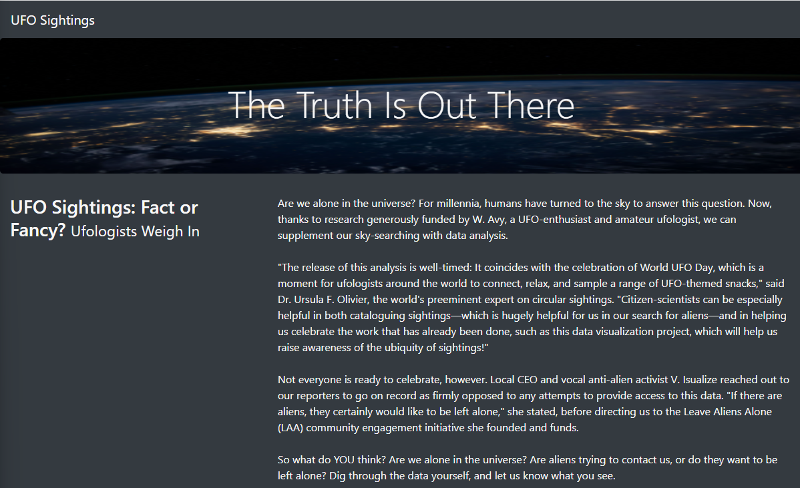
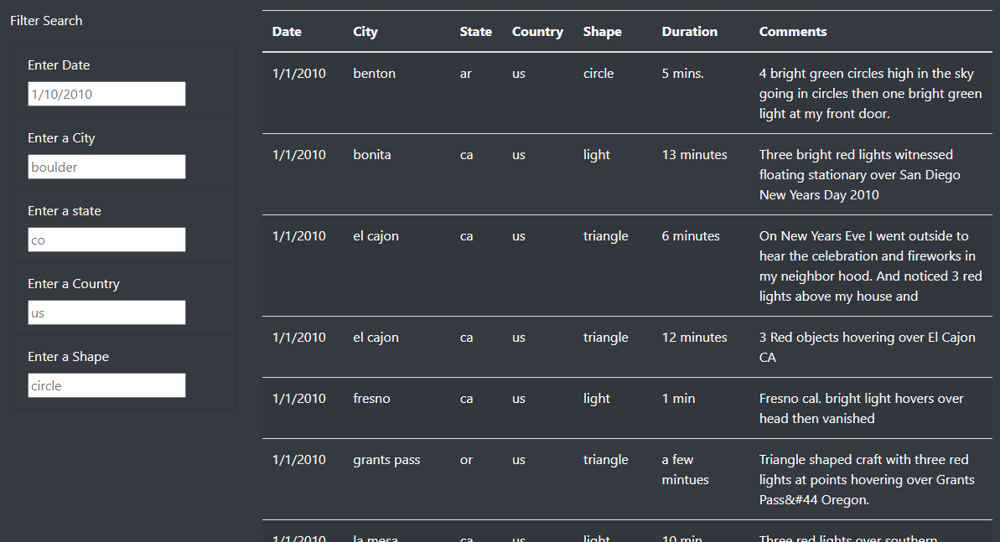
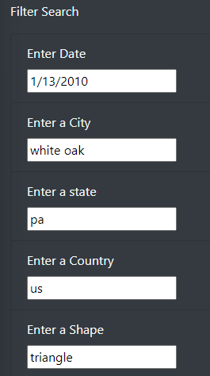
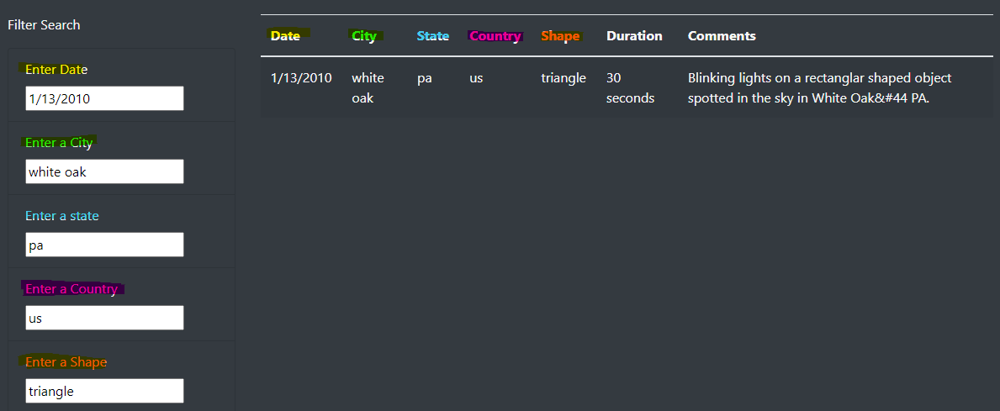

# UFOs

## Overview

Using JavaScript, HTML, and CSS build webpages to display a table organizing UFO sightings data.

### Purpose

Using the tools mentioned above, a dynamic webpage will be built in which the data concerning UFO sightings can be stored, displayed visually, and be interative (able to filter based on search criteria). Having a dynamic website allows the data to be visually appealing and easy to access for everyone. Sifting through data manually in a table or array can be tedious but having a interactive website allows data access and understanding to be attainable to everyone.

## Results

UFO Sightings:

Filters and the table:

Using the filter search, you can filter by any combinations of the search criteria. For example: you can search only by date or by every category. The search criteria corresponds with the columns of the table. All but the last two columns, 'Duration' and 'Comments,' are available to filter. 

Example of a filtered search:

